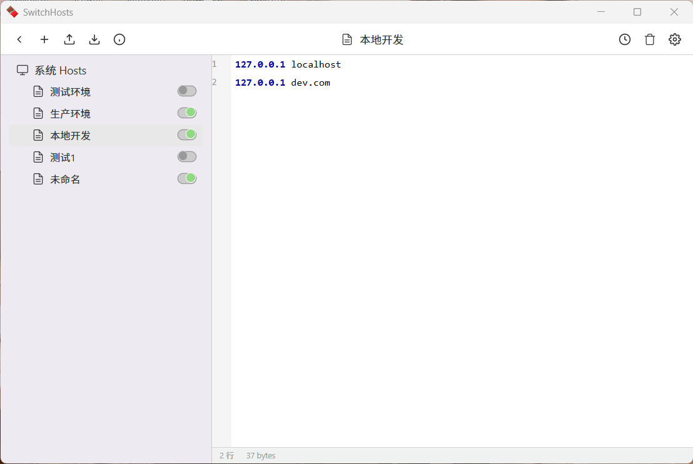

# SwitchHosts

一款使用 Wails 框架（Go + Vue 3）构建的Hosts管理工具，轻量、快速、跨平台，支持 Windows 和 macOS。

## 特性

- **树形结构管理**：以树形结构管理多个Hosts配置项
- **快速切换**：一键启用/禁用单个Hosts条目，自动应用更改到系统Hosts文件
- **语法高亮**：专业的代码编辑器，支持Hosts文件语法高亮
- **远程Hosts**：支持远程URL的Hosts配置，可自动刷新
- **文件夹模式**：将Hosts条目分组，支持单选/多选模式
- **回收站**：软删除功能，支持恢复
- **导入/导出**：备份和恢复您的Hosts配置
- **历史记录**：跟踪系统Hosts文件的更改
- **多语言**：支持中文和英文
- **主题切换**：支持浅色/深色主题

## 界面预览



## 快速开始

### 前置要求

- Go 1.21+
- Node.js 18+
- Wails CLI

### 安装依赖并运行

```bash
# 克隆项目
git clone https://github.com/wangchaojun/switch-hosts-wails.git
cd switch-hosts-wails

# 安装前端依赖
cd frontend && npm install && cd ..

# 开发模式运行
wails dev

# 生产构建
wails build
```

### 下载发布版本

从 [Releases](https://github.com/wangchaojun/switch-hosts-wails/releases) 下载最新的 `switch-hosts-wails.exe` 并运行。

## 使用说明

### 添加Hosts

1. 点击左上角的 **+** 按钮
2. 选择类型：本地( local )、远程( remote )、文件夹( folder )或分组( group )
3. 填写名称（远程Hosts需填写URL）
4. 点击确定

### 启用/禁用Hosts

点击每个Hosts条目旁边的开关。开关状态改变后会自动应用更改到系统Hosts文件。

### 编辑Hosts内容

1. 点击左侧面板中的Hosts条目
2. 在编辑器中编辑内容
3. 编辑后1秒无操作自动保存

### 导入/导出

点击顶部工具栏的导入/导出按钮来备份或恢复配置。

### 偏好设置

点击顶部工具栏的设置图标可打开偏好设置：
- 语言切换（中文/English）
- 主题切换（浅色/深色）
- 写入模式（追加/覆盖）
- 选择模式（默认/单选/多选）

## 数据存储

配置文件位置：
- Windows: `%APPDATA%\SwitchHosts`
- macOS/Linux: `~/.SwitchHosts`

数据文件位置：
- Windows: `%APPDATA%\SwitchHosts\data`
- macOS/Linux: `~/.SwitchHosts/data`

## 技术栈

- **后端**: Go, Wails
- **前端**: Vue 3, TypeScript, Pinia, CodeJar
- **数据库**: SQLite
- **编辑器**: CodeJar（自定义语法高亮）

## 与原版SwitchHosts对比

| 功能 | 原版(Electron) | 本项目(Wails) |
|------|----------------|---------------|
| 核心功能 | ✓ | ✓ |
| Hosts树形管理 | ✓ | ✓ |
| 语法高亮 | ✓ | ✓ |
| 远程Hosts | ✓ | ✓ |
| 自动刷新 | ✓ | ✓ |
| 导入/导出 | ✓ | ✓ |
| 多语言 | ✓ | ✓ |
| 系统托盘图标 | ✓ | 计划中 |
| 自动更新 | ✓ | 计划中 |
| 启动速度 | 较慢 | **极快** |
| 内存占用 | 较高 | **极低** |

## 为什么重写？

原版SwitchHosts基于Electron开发，启动较慢且内存占用较高。本项目使用Wails框架重写，具有以下优势：

- **启动速度快**：Go后端编译为原生二进制文件
- **内存占用低**：无Chromium进程开销
- **体积小**：打包后体积显著减小

## 项目结构

```
switch-hosts-wails/
├── main.go              # Go应用入口
├── app.go               # Wails应用逻辑
├── internal/
│   ├── config/          # 配置管理
│   ├── hosts/           # Hosts数据管理
│   ├── i18n/            # 国际化
│   └── migrate/         # 数据迁移
├── frontend/
│   ├── src/
│   │   ├── App.vue      # 主组件
│   │   ├── components/  # Vue组件
│   │   └── stores/      # Pinia状态管理
│   └── index.html
└── wails.json           # Wails配置
```

## License

MIT License

## 致谢

本项目灵感来自 [SwitchHosts](https://github.com/oldj/SwitchHosts) by oldj。这是一次Wails实现的尝试，旨在提供与原版Electron版本相同的功能，同时获得更好的性能。

## 联系方式

- GitHub: https://github.com/wangchaojun/switch-hosts-wails
- Gitee: https://gitee.com/wangchaojun/switch-hosts-wails
- Email: 751849652@qq.com

## 贡献

欢迎提交Issue和Pull Request！
